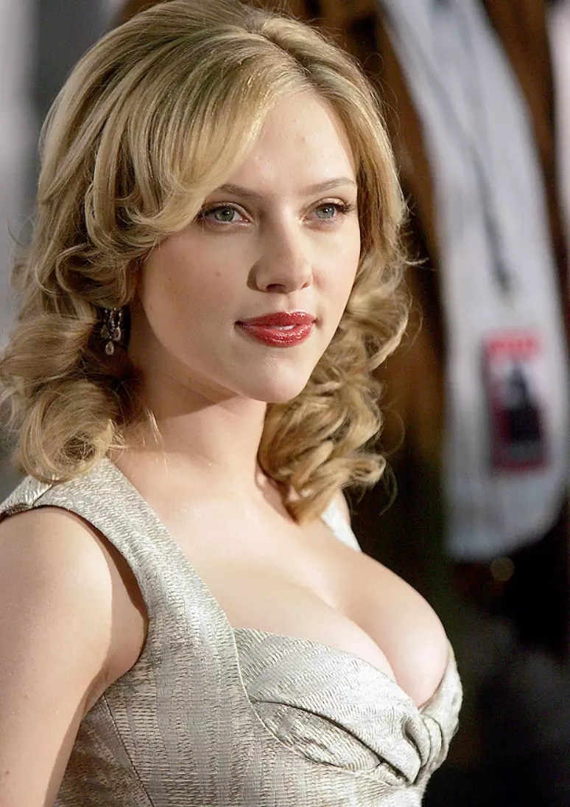

# Style-Transfer

This is a simple Style-Transfer project using VGG16. Below are the results, You can see other generated images in the `images/generated-images/` folder, where results after different iterations are saved.

<table>
<tr>
<td></td>
<td></td>
<td></td>
</tr>
<tr>
<td align="center"><strong>Original Image</strong></td>
<td align="center"><strong>Art Style</strong></td>
<td align="center"><strong>Result after 4000 iterations</strong></td>
</tr>
</table>
